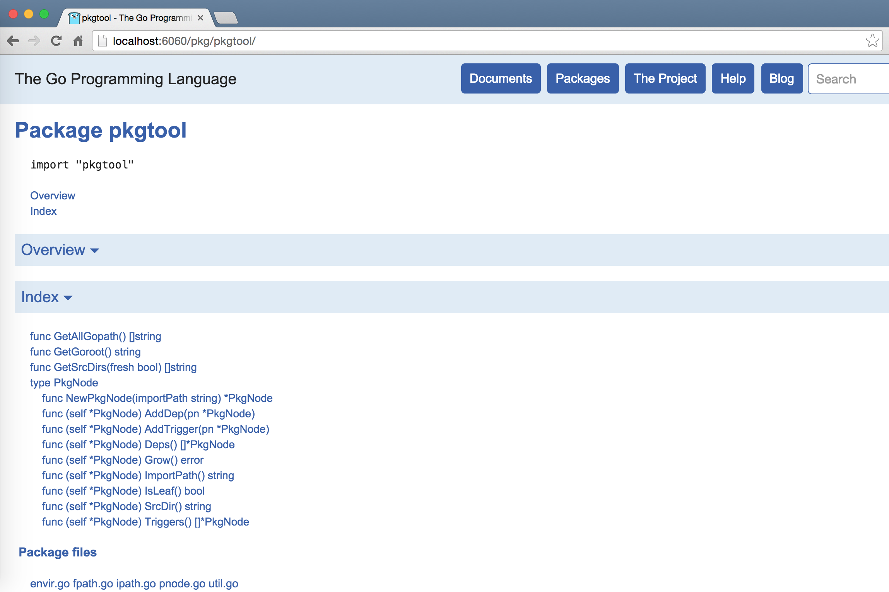

# go doc与godoc

## go doc

`go doc`命令可以打印附于Go语言程序实体上的文档。我们可以通过把程序实体的标识符作为该命令的参数来达到查看其文档的目的。

**插播：**所谓Go语言的程序实体，是指变量、常量、函数、结构体以及接口。而程序实体的标识符即是代表它们的名称。标识符又分非限定标识符和限定标识符。其中，限定标识符一般用于表示某个代码包中的程序实体或者某个结构体类型中的方法或字段。例如，标准库代码包`io`中的名为`EOF`的变量用限定标识符表示即`io.EOF`。又例如，如果我有一个`sync.WaitGroup`类型的变量`wg`并且想调用它的`Add`方法，那么可以这样写`wg.Add()`。其中，`wg.Add`就是一个限定标识符，而后面的`()`则代表了调用操作。

下面说明怎样使用`go doc`命令。先来看一下`go doc`命令课结束的标记。

_表0-5 ```go doc```命令的标记说明_

标记名称    | 标记描述
---------- | -------
-c         | 加入此标记后会使`go doc`命令区分参数中字母的大小写。默认情况下，命令是大小写不敏感的。
-cmd       | 加入此标记后会使`go doc`命令同时打印出`main`包中的可导出的程序实体（其名称的首字母大写）的文档。默认情况下，这部分文档是不会被打印出来的。
-u         | 加入此标记后会使`go doc`命令同时打印出不可导出的程序实体（其名称的首字母小写）的文档。默认情况下，这部分文档是不会被打印出来的。

这几个标记的意图都非常简单和明确，大家可以根据实际情况选用。

`go doc`命令可以后跟一个或两个参数。当然，我们也可以不附加任务参数。如果不附加参数，那么`go doc`命令会试图打印出当前目录所代表的代码包的文档及其中的包级程序实体的列表。

例如，我要在goc2p项目的`loadgen`代码包所在目录中运行`go doc`命令的话，那么就会是这样：

```bash
hc@ubt:~/golang/goc2p/src/loadgen$ go doc
package loadgen // import "loadgen"

func NewGenerator(
	caller lib.Caller,
	timeoutNs time.Duration,
	lps uint32,
	durationNs time.Duration,
	resultCh chan *lib.CallResult) (lib.Generator, error)
```

如果你需要指定代码包或程序实体，那么就需要在`go doc`命令后附上参数了。例如，只要我本地的goc2p项目的所在目录存在于GOPATH环境变量中，我就可以在任意目录中敲入`go doc loadgen`。如此得到的输出一定是与上面那个示例一致的。

看过`loadgen`代码包中源码的读者会知道，其中只有一个可导出的程序实体，即`NewGenerator`函数。这也是上述示例中如此输出的原因。该代码包中的结构体类型`myGenerator`是不可导出，但是我们只需附加`-u`标记便可查看它的文档了：

```bash
hc@ubt:~$ go doc -u loadgen.myGenerator
type myGenerator struct {
	caller      lib.Caller           // 调用器。
	timeoutNs   time.Duration        // 处理超时时间，单位：纳秒。
	lps         uint32               // 每秒载荷量。
	durationNs  time.Duration        // 负载持续时间，单位：纳秒。
	concurrency uint32               // 并发量。
	tickets     lib.GoTickets        // Goroutine票池。
	stopSign    chan byte            // 停止信号的传递通道。
	cancelSign  byte                 // 取消发送后续结果的信号。
	endSign     chan uint64          // 完结信号的传递通道，同时被用于传递调用执行计数。
	callCount   uint64               // 调用执行计数。
	status      lib.GenStatus        // 状态。
	resultCh    chan *lib.CallResult // 调用结果通道。
}

    载荷发生器的实现。

func (gen *myGenerator) Start()
func (gen *myGenerator) Status() lib.GenStatus
func (gen *myGenerator) Stop() (uint64, bool)
func (gen *myGenerator) asyncCall()
func (gen *myGenerator) genLoad(throttle <-chan time.Time)
func (gen *myGenerator) handleStopSign(callCount uint64)
func (gen *myGenerator) init() error
func (gen *myGenerator) interact(rawReq *lib.RawReq) *lib.RawResp
func (gen *myGenerator) sendResult(result *lib.CallResult) bool
```

如此一来，`loadgen.myGenerator`类型的文档、字段和方法都尽收眼底。注意，这里我们使用到了限定标识符。下面再进一步，如果你只想查看`loadgen.myGenerator`类型的`init`方法的文档，那么只要续写这个限定标识符就可以了，像这样：

```bash
hc@ubt:~$ go doc -u loadgen.myGenerator.init
func (gen *myGenerator) init() error

    初始化载荷发生器。
```

注意，结构体类型中的字段的文档是无法被单独打印的。另外，`go doc`命令根据参数查找代码包或程序实体的顺序是：先Go语言根目录（即GOROOT所环境变量指定的那个目录）后工作区目录（即GOPATH环境变量包含的那些目录）。并且，在前者或后者中，`go doc`命令的查找顺序遵循字典序。因此，如果某个工作区目录中的代码包与标准库中的包重名了，那么它是无法被打印出来的。`go doc`命令只会打印出第一个匹配的代码包或程序实体的文档。

我们在前面说过，`go doc`命令还可以接受两个参数。这是一种更加精细的指定代码包或程序实体的方式。一个显著的区别是，如果你想打印标准库代码包`net/http`中的结构体类型`Request`的文档，那么可以这样敲入`go doc`命令：

```bash
go doc http.Request
```
注意，这里并没有写入`net/http`代码包的导入路径，而只是写入了其中的最后一个元素`http`。但是如果你把`http.Request`拆成两个参数（即` http Request`）的话，命令程序就会什么也查不到了。因为这与前一种用法的解析方式是不一样的。正确的做法是，当你指定两个参数时，作为第一个参数的代码包名称必须是完整的导入路径，即：在敲入命令`go doc net/http Request`后，你会得到想要的结果。

最后，在给定两个参数时，`go doc`会打印出所有匹配的文档，而不是像给定一个参数时那样只打印出第一个匹配的文档。这对于查找只有大小写不同的多个方法（如`New`和`new`）的文档来说非常有用。

## godoc
命令`godoc`是一个很强大的工具，同样用于展示指定代码包的文档。在Go语言的1.5版本中，它是一个内置的标准命令。

该命令有两种模式可供选择。如果在执行命令时不加入`-http`标记，则该命令就以命令行模式运行。在打印纯文本格式的文档到标准输出后，命令执行就结束了。比如，我们用命令行模式查看代码包fmt的文档：

```bash
hc@ubt:~$ godoc fmt
```
	
为了节省篇幅，我们在这里略去了文档查询结果。读者可以自己运行一下上述命令。在该命令被执行之后，我们就可以看到编排整齐有序的文档内容了。这包括代码包`fmt`及其中所有可导出的包级程序实体的声明、文档和例子。

有时候我们只是想查看某一个函数或者结构体类型的文档，那么我们可以将这个函数或者结构体的名称加入命令的后面，像这样：

```bash
hc@ubt:~$ godoc fmt Printf
```
	
或者：

```bash
hc@ubt:~$ godoc os File
```
	
如果我们想同时查看一个代码包中的几个函数的文档，则仅需将函数或者结构体名称追加到命令后面。比如我们要查看代码包`fmt`中函数`Printf`和函数`Println`的文档：

```bash
hc@ubt:~$ godoc fmt Printf Println
```
	
如果我们不但想在文档中查看可导出的程序实体的声明，还想看到它们的源码，那么我们可以在执行`godoc`命令的时候加入标记`-src`，比如这样：

```bash
hc@ubt:~$ godoc -src fmt Printf
```
	
Go语言为程序使用示例代码设立了专有的规则。我们在这里暂不讨论这个规则的细节。只需要知道正因为有了这个专有规则，使得`godoc`命令可以根据这些规则提取相应的示例代码并把它们加入到对应的文档中。如果我们想在查看代码包`net`中的结构体类型`Listener`的文档的同时查看关于它的示例代码，那么我们只需要在执行命令时加入标记`-ex`。使用方法如下：

```bash
hc@ubt:~$ godoc -ex net/http FileServer
```

注意，我们在使用`godoc`命令时，只能把代码包和程序实体的标识符拆成两个参数。也就是说，`godoc`命令不支持前文所述的`go doc`命令的单参数用法。
	
在实际的Go语言环境中，我们可能会遇到一个命令源码文件所产生的可执行文件与代码包重名的情况。比如，这里介绍的标准命令`go`和官方代码包`go`。现在我们要明确的告诉`godoc`命令要查看可执行文件go的文档，我们需要在名称前加入`cmd/`前缀：

```bash
hc@ubt:~$ godoc cmd/go
```
	
另外，如果我们想查看HTML格式的文档，就需要加入标记`-html`。当然，这样在命令行模式下的查看效果是很差的。但是，如果仔细查看的话，可以在其中找到一些相应源码的链接地址。

一般情况下，`godoc`命令会去Go语言根目录和环境变量GOPATH包含的工作区目录中查找代码包。我们可以通过加入标记`-goroot`来制定一个Go语言根目录。这个被指定的Go语言根目录仅被用于当次命令的执行。示例如下：

```bash
hc@ubt:~$ godoc -goroot="/usr/local/go" fmt
```

现在让我们来看看另外一种模式。如果我们在执行命令时加上`-http`标记则会启用另一模式。这种模式被叫做Web服务器模式，它以Web页面的形式提供Go语言文档。

我们使用如下命令启动这个文档Web服务器：

```bash
hc@ubt:~/golang/goc2p$ godoc -http=:6060
```
	
标记`-http`的值`:6060`表示启动的Web服务器使用本机的6060端口。之后，我们就可以通过在网络浏览器的地址栏中输入[http://localhost:6060](http://localhost:6060)来查看以网页方式展现的Go文档了。


_图0-1 本机的Go文档Web服务首页_

这与[Go语言官方站点](http://golang.org)的Web服务页面如出一辙。这使得我们在不方便访问Go语言官方站点的情况下也可以查看Go语言文档。并且，更便利的是，通过本机的Go文档Web服务，我们还可以查看所有本机工作区下的代码的文档。比如，goc2p项目中的代码包`pkgtool`的页面如下图：



_图0-2 goc2p项目中的pkgtool包的Go文档页面_

现在，我们在本机开启Go文档Web服务器，端口为9090。命令如下:
```bash
hc@ubt:~$ godoc -http=:9090 -index
```
	
注意，要使用`-index`标记开启搜索索引。这个索引会在服务器启动时创建并维护。如果不加入此标记，那么无论在Web页面还是命令行终端中都是无法进行查询操作的。

索引中提供了标识符和全文本搜索信息（通过正则表达式为可搜索性提供支持）。全文本搜索结果显示条目的最大数量可以通过标记`-maxresults`提供。标记`-maxresults`默认值是10000。如果不想提供如此多的结果条目，可以设置小一些的值。甚至，如果不想提供全文本搜索结果，可以将标记`-maxresults`的值设置为0，这样服务器就只会创建标识符索引，而根本不会创建全文本搜索索引了。标识符索引即为对程序实体名称的索引。

正因为在使用了`-index`标记的情况下文档服务器会在启动时创建索引，所以在文档服务器启动之后还不能立即提供搜索服务，需要稍等片刻。在索引为被创建完毕之前，我们的搜索操作都会得到提示信息“Indexing in progress: result may be inaccurate”。

如果我们在本机用`godoc`命令启动了Go文档Web服务器，且IP地址为192.168.1.4、端口为9090，那么我们就可以在另一个命令行终端甚至另一台能够与本机联通的计算机中通过如下命令进行查询了。查询命令如下：

```bash
	hc@ubt:~$ godoc -q -server="192.168.1.4:9090" Listener
```

命令的最后为要查询的内容，可以是任何你想搜索的字符串，而不仅限于代码包、函数或者结构体的名称。

标记`-q`开启了远程查询的功能。而标记`-server="192.168.1.4:9090"`则指明了远程文档服务器的IP地址和端口号。实际上，如果不指明远程查询服务器的地址，那么该命令会自行将地址“:6060”和“golang.org”作为远程查询服务器的地址。这两个地址即是默认的本机文档Web站点地址和官方的文档Web站点地址。所以执行如下命令我们也可以查询到标准库的信息：

```bash
hc@ubt:~$ godoc -q fmt
```
	
命令`godoc`还有很多可用的标记，但在通常情况下并不常用。读者如果有兴趣，可以在命令行环境下敲入`godoc`并查看其文档。

至于怎样才能写出优秀的代码包文档，我在《Go并发编程实战》的5.2节中做了详细说明。
